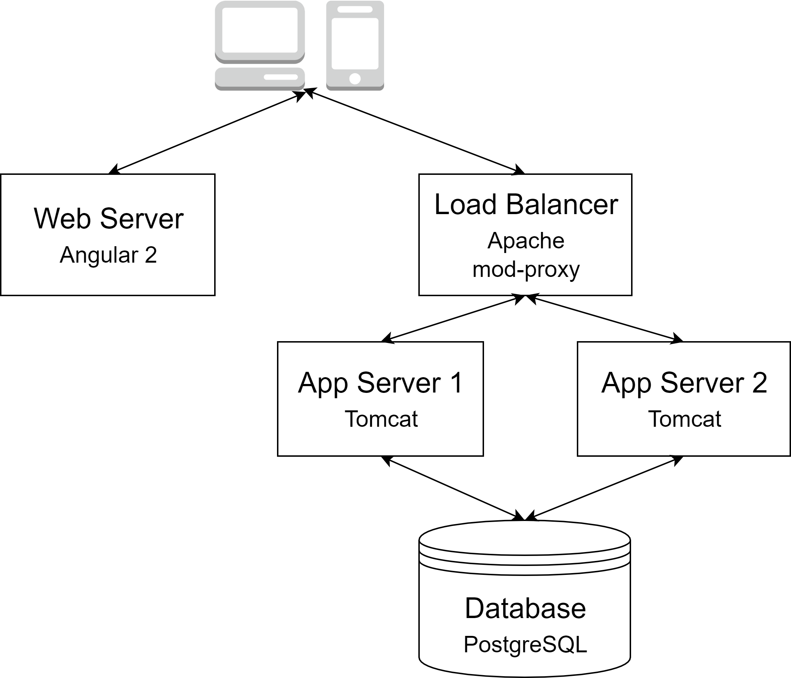
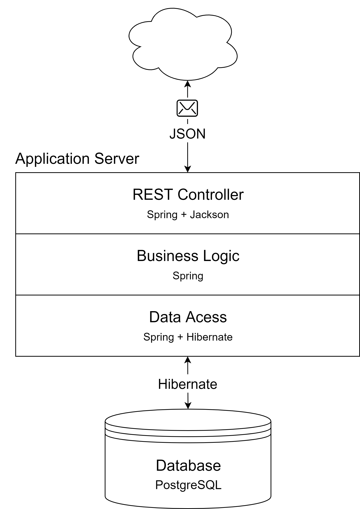

# Evaluation System

Evaluation System was an academic project which would allow students to take online tests by answering multiple-choice questions.

## UI

As an example, this is the page that professors would view when creating an exam for their class:

## Architecture

The system is composed of a frontend (web server) and a backend (application server), which communicate via a REST API. Because the app server does not store any state about the client session, we were able to easily replicate it and use a load balancer to distribute the work load between the two app servers.

## Technologies

- Frontend: Angular 2
- Backend: Java (Spring + Hibernate)

